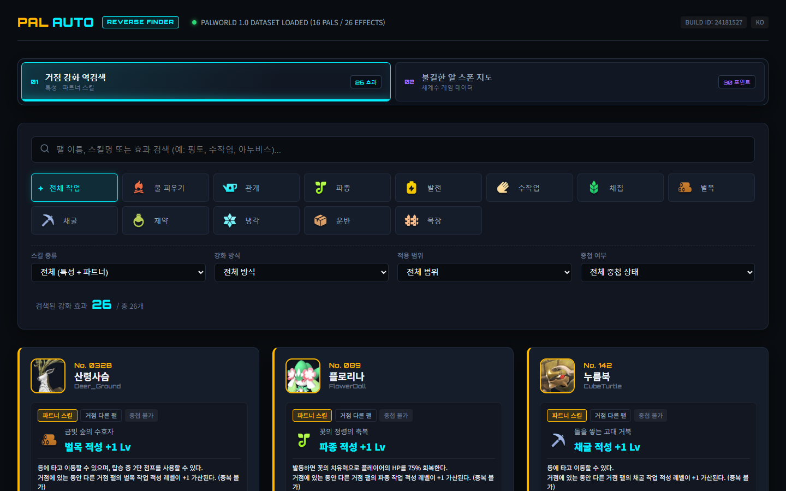

# Pal-comf WebApp

> **선택 과제:** 과제 A — 작은 자동화 도구 만들기<br>
> **무슨 주제인가:** 팰월드 1.0에서 거점 작업을 강화하는 패시브·파트너 스킬·팰을 역검색하는 도구다.<br>
> **무엇이 불편했나:** 정식 버전에 새 패시브와 스킬이 생겼지만 인게임 검색이 없고, 기존 DB는 팰을 하나씩 열어봐야 필요한 효과를 찾을 수 있다.<br>
> **그래서 무엇을 만들었나:** 작업 또는 패시브 키워드 하나로 관련 팰·효과·수치를 바로 찾는 로컬 웹앱을 만들었다.



## 실행 영상

https://github.com/user-attachments/assets/9931e807-23aa-491d-8991-18d986de81d7

**[원본 WebM 다운로드](output/playwright/pal-comf-demo.webm)** · 1440×900 · 46.04초 · 4.68MB · 작업 효과 기반 팰 탐색, 패시브 정보 확인, 불길한 알 지도와 좌표 확인

## 30초 요약

팰월드는 팰마다 거점에서 잘하는 작업이 다르고, 특성이나 파트너 스킬이 그
작업의 적성 레벨 또는 속도를 강화한다. 문제는 게임 UI가 “수작업을 강화하는
모든 수단”처럼 효과에서 출발하는 역검색을 제공하지 않는다는 점이다.

Pal-comf WebApp은 외부 위키를 런타임 데이터로 쓰지 않는다. 현재 Steam
설치본의 `Pal-Windows.pak`에서 필요한 DataTable, 한국어 텍스트, 팰 썸네일,
작업 아이콘과 UI 텍스처만 읽어 정적 JSON·웹 이미지로 변환한다. React
프론트는 그 생성물만 읽고 게임 원본과 세이브는 수정하지 않는다.

현재 기준은 Steam App `1623730`, Build ID `24181527`이다. MVP 데이터는
거점 강화 효과가 있는 팰 16종, 파트너 스킬 16종, 표시 가능한 작업 강화
특성 9종, 정규화 효과 26개, 세계수 알 추첨 포인트 30곳이며 생성기 무결성
오류는 0개다.

## 핵심 기능

- 12개 대표 거점 작업 종류에서 원하는 작업을 먼저 선택
- 특성 / 파트너 스킬, 작업 속도 / 작업 적성 레벨, 적용 범위, 중첩 상태 필터
- 팰 썸네일, 한국어 이름, 기본 작업 적성, 1~5성 파트너 효과 표시
- 일반·노란·파란·세계수 패시브를 설치본 WBP Rank 분기와 UI 텍스처로 표시
- 검색어·필터가 가리키는 실제 효과 단위만 카드로 반환
- 별도 탭에서 설치본 세계수 지도와 알 스포너 30곳 표시
- 지도 드래그, 커서 기준 휠 100~500% 확대, 포인트별 인게임 좌표 확인
- Build ID, 추출 시각, pak 경로와 원문 근거 보존

## 과제 제출물 1 — AI 활용 기록

**[작업 대화 기록 PDF](output/pdf/pal-comf-work-conversation-log.pdf)** — 실제 Codex 작업 대화의 핵심 발화와 사용자의 의심·재요청, 검증 및 수정 결과를 8쪽으로 정리했다.

### 사용한 AI 도구

| 도구 | 실제 사용 범위 |
| --- | --- |
| **OpenAI Codex 데스크톱 앱 (GPT-5 계열)** | 문제 분해, pak 조사 계획, C# 추출기·React 구현, 로컬 셸/브라우저 검증, 테스트와 문서화 |
| **Google Antigravity** | 프론트 시각 시안 생성. 시안의 컴포넌트 구조를 저장소에 가져온 뒤 Codex가 실제 생성 데이터·검색 로직·테스트와 결합 |

`repak`, CUE4Parse, Playwright, Vitest는 AI가 아니라 AI의 답을 검증하고 결과를
재현하기 위해 실행한 도구다. 도구 역할을 섞어 부풀리지 않았다.

### 프롬프트 → AI 답변·행동 → 사용자 대응

실제 발화 발췌는 위 PDF에 역할별 대화 상자로 수록했다. 아래 표는 같은 사례를
빠르게 확인하기 위한 요약이다. 사용자 프롬프트는 당시 표현을 옮겼으며,
`[요약]` 표시는 게임 고유명사를 문제 유형으로 바꾼 항목이다. AI 답변·행동과
검증 칸은 직접 인용이 아니라 작업 로그를 기준으로 요약했다.
전체 과정은 [AI 작업 기록](docs/AI_WORKLOG.md)에 원인, 명령, 실패와 수정 결과까지 남겼다.

| 사용자 요청 발췌·요약 | AI의 답변·행동 | 사용자의 의심·대응 | 검증과 최종 수정 |
| --- | --- | --- | --- |
| “팰 정보 데이터는 게임데이터로 따라가는게 맞음” | 외부 사이트 데이터를 가져오는 방향을 버리고 설치본 pak을 1차 기준으로 전환 | 위키와 현재 1.0 빌드가 다를 수 있으니 설치본 값을 우선하라고 못 박음 | `DT_PalMonsterParameter` 753행을 현재 매핑으로 직렬화. 외부 페이지는 핑토 표본 교차검증에만 사용 |
| [요약] 선택한 작업과 관계없는 팰이 검색 결과에 노출됨 | 초기 검색기는 특정 작업 ID가 없는 효과를 모든 작업의 결과에 포함 | 한 건만 수정하지 않고 전체 필터와 효과를 다시 검수하도록 요청 | 대상 팰의 실제 작업 적성으로 적용 범위를 생성하고 작업 필터 12종 회귀 테스트 추가 |
| “초절기교는 파란색 아니였나? 장인기질은 노란색이였고” | AI가 특성 획득 풀 플래그를 UI 색상 근거로 잘못 추론해 장인 기질·초절기교 색상을 틀리게 생성 | 인게임 기억과 화면을 근거로 전체 패시브 매칭을 다시 요구 | `WBP_MainMenu_Pal_Skill_Passive.SetPassiveSkill` 분기와 Rank 0~5 화살표를 직접 읽음. 장인 기질 Rank 3=노란색, 초절기교 Rank 4=파란색, 악마의 손 Rank 5=세계수로 전수 수정 |
| “4번알은 뭐임” | 지도에서 포인트 4가 섬 실루엣 밖에 보이므로 프론트 좌표 오류 가능성을 조사 | 보기 좋게 안쪽으로 옮기지 말고 원본 오류인지 확인하게 함 | source package의 actor와 root component를 재직렬화해 `(-1481, 1553)`, Z `27175` 확인. 원본 배치이므로 수동 보정 없이 유지 |
| “지도 확대 500% 까지 가능하도록 만들어줘” | 단일 줌 상한을 2.5에서 5로 올리고 기존 좌표 계산을 유지 | 확대 뒤 마커가 밀리면 기능 의미가 없으므로 500% 경계와 포인트 4를 다시 확인 | 실제 브라우저에서 500%, 추가 휠 상한, 드래그, 정규화 좌표와 탭 상태 보존을 검증. 지도 순수 함수 테스트 포함 총 27개 통과 |

### AI 답을 재검증해 교정한 대표 사례

가장 큰 오류는 패시브 색상과 작업 필터의 적용 범위였다. 둘 다 화면만 그럴듯하게
보면 놓치기 쉽다. 패시브는 “획득 가능한 풀”과 “UI Rank”를 다른 개념으로
분리했고, 검색 범위는 `workSuitabilityId=null`을 무조건 전 작업으로 보지 않고
효과 대상 팰의 실제 적성을 다시 결합했다. AI의 첫 구현을 그대로 붙이지 않고
게임 구조 필드, 한국어 원문, WBP 바이트코드와 브라우저 회귀 테스트가 동시에
맞을 때만 확정했다.

추가로 AI가 기억에 의존해 제안한 CUE4Parse의 `Name.Text`, 컬렉션 `Count`,
텍스처 디코딩 반환형도 실제 고정 NuGet 소스와 컴파일러가 반박했다. 소스의
정확한 API를 읽어 `Name`, `Count()`, `CTexture.ToSkBitmap()` 흐름으로 고쳤다.

## 과제 제출물 2 — 회고

### 이번 작업에서 가장 잘됐다고 느낀 점

이번 작업에서 가장 잘됐다고 느낀 점은 내가 불편했던 점을 확실하게 해결한
것이다. 정식 버전에 새로운 패시브와 스킬이 생겼지만 인게임 검색 기능이
없었고, 기존 DB도 팰을 하나씩 확인해야 했다. 작업이나 패시브 키워드 하나로
필요한 팰을 바로 찾을 수 있게 만들었다.

### 어떤 순서로 도구를 썼나

1. Codex로 문제와 안전 경계를 분해하고 현재 Steam manifest·pak 인덱스를 읽었다.
2. `repak`으로 40GB pak을 통째로 풀지 않고 후보 자산 경로와 Oodle 압축을 확인했다.
3. C# + CUE4Parse로 현재 `.usmap` 호환성을 검증하고 팰 5종 샘플을 먼저 결합했다.
4. 설치본 구조 필드, 한국어 원문과 외부 1.0 핑토 페이지를 표본 대조했다.
5. 전체 거점 강화 효과를 정규화하고 Antigravity 시안을 실제 데이터와 결합했다.
6. 사용자 피드백으로 검색 필터 범위, 패시브 색상, 카드 높이와 지도 좌표를 다시 검증했다.
7. Vitest·TypeScript·ESLint·프로덕션 빌드와 Playwright 실제 브라우저 녹화로 마감했다.

### 막힌 지점과 AI를 활용한 방법

중간중간 크게 막히는 부분은 없었다. 굳이 하나를 고르면 디자인 부분이었다.
패시브 UI 종류, 작업 아이콘 크기와 색, 카드 높이와 세계수 보라색 효과를
실제 화면에서 확인하고 원하는 변경점을 하나씩 구체적으로 전달했다.

### AI 결과를 검수한 방식

AI가 도출한 결과를 그냥 “아 그렇구나” 하고 적용하지 않았다. 왜 그렇게
했는지, 다른 더 좋은 방법은 없는지, 지금 방법이 제대로 된 건지를 계속
질문하고 검수하면서 작업했다.

### 결과가 틀리거나 마음에 들지 않았을 때

선택한 작업과 관계없는 결과가 노출되는 문제를 발견했을 때 한 건만 고치지 않고
전체 효과와 필터를 다시 검수하도록 요청했다. 패시브 색상이 기억한 화면과
다를 때도 이름별로 임의 지정하지 않고 게임 파일의 Rank 분기와 실제 UI 자산을
전부 확인하게 했다. 수정된 화면과 영상은 로컬에서 먼저 확인한 뒤 다음
작업으로 넘어갔다.

### 다시 한다면

중간중간 막히는 부분이 크게 없었지만, 만약 더 복잡한 작업을 했을 땐 모든
막혔던 지점을 기록하고 시도했던 방법을 일단 기록하여 실패 아카이브를 만들고
다음 작업 때 비슷한 상황이 나왔을 때 참고할 수 있도록 할 것 같다.

AI가 틀리거나 이상하게 작업할 시 지침이 없다면 간단하게 지침을 세우고
정확하게 작업할 수 있도록 세세하게 설명하면서 차근차근 문제를 풀어간 뒤,
해결이라는 방향으로 성공적으로 흘러간 해당 흐름을 메모리에 저장할 수 있도록
문서화시켜서 다시 사용할 수 있도록 하는 방식을 사용할 것 같다.

더 자세한 내용은 [전체 회고](docs/RETROSPECTIVE.md)에 있다.

## 과제 제출물 3 — 결과물

- [작업 대화 기록 PDF](output/pdf/pal-comf-work-conversation-log.pdf)
- [실행 영상 바로 재생](https://github.com/user-attachments/assets/9931e807-23aa-491d-8991-18d986de81d7)
- [실행 영상 원본 WebM](output/playwright/pal-comf-demo.webm)
- [영상 장면·내레이션 가이드](docs/DEMO_SCRIPT.md)
- [제출 체크리스트와 메일 템플릿](docs/SUBMISSION.md)
- [AI 작업 기록](docs/AI_WORKLOG.md)
- [회고](docs/RETROSPECTIVE.md)
- [설치본 자산·필드 근거](docs/DATA_MAP.md)
- [외부 표본 교차검증](docs/EXTERNAL_VALIDATION.md)

## 구조

```text
Pal-Windows.pak (읽기 전용)
        │
        ▼
tools/extractor  ── CUE4Parse + 현재 빌드 .usmap
        │
        ├─ data/generated/*.json
        └─ public/generated/**/*.webp|png
        │
        ▼
React 웹앱  ── 정적 생성물만 읽음, pak·세이브에 쓰기 없음
```

추출기와 UI를 분리했기 때문에 게임 업데이트 뒤에는 생성 단계만 다시 실행할
수 있다. 생성 JSON에는 schema version, Build ID, 추출 시각, 원본 자산 경로와
근거 상태를 남긴다.

## 로컬 실행

### 전제

- Node.js 24, pnpm 10
- 직접 데이터 생성 시 .NET 10 SDK, 설치된 Palworld, 현재 빌드와 맞는 `.usmap`
- 게임 원본·매핑·생성 게임 이미지는 저작권과 용량 때문에 저장소에 포함하지 않음

### 1. 의존성 설치

```powershell
pnpm install
pnpm --dir .\prototypes\antigravity-frontend install
```

### 2. 게임 데이터 생성

```powershell
.\tools\extractor\generate.ps1 `
  -MappingPath .\.cache\mappings\Mapping101\Mappings101.usmap
```

Steam 설치 경로가 기본값과 다르면 `-GameRoot`를 같이 넘긴다.

```powershell
.\tools\extractor\generate.ps1 `
  -GameRoot 'D:\SteamLibrary\steamapps\common\Palworld' `
  -MappingPath 'D:\path\to\Mappings101.usmap'
```

생성물은 `data/generated`, 팰·UI·지도 이미지는 `public/generated` 아래에
만들어진다. 추출기는 출력 경로가 Palworld 설치 폴더 내부면 실행을 거부한다.

### 3. 최신 웹앱 실행

```powershell
pnpm dev
```

접속 주소: `http://127.0.0.1:5174/`

기존 초기 UI를 비교해야 할 때만 `pnpm dev:legacy`를 쓴다.

## 검증

```powershell
pnpm lint
pnpm typecheck
pnpm test
pnpm build
```

현재 결과는 ESLint 오류 0, TypeScript 오류 0, Vitest 5파일 27개 통과,
루트와 최신 Antigravity 프론트 프로덕션 빌드 통과다. 추출기는 팰·스킬 ID
중복, 끊긴 참조, 한국어 텍스트, 양수 효과, 5단계 랭크, 이미지 크기·해시,
패시브 UI 스타일, 작업 적용 범위와 세계수 포인트 30개를 생성 시 검사한다.

로컬 서버가 실행 중이면 최신 동작 영상을 다시 만들 수 있다.

```powershell
pnpm demo:record
```

영상이 잘 닫혔는지, 해상도·재생 시간이 맞는지와 주요 타임스탬프 프레임을
다시 확인할 때는 아래 명령을 쓴다. 검수 프레임은 Git에 포함하지 않는다.

```powershell
pnpm demo:review
```

## 확인된 한계

- 전체 도감 복제가 아니라 **거점 작업 강화 효과 역검색**이 MVP다. 현재 팰
  16종은 설치본에서 해당 효과가 확인된 팰이며 모든 도감 팰을 넣었다는 뜻이 아니다.
- 게임 Build ID가 바뀌면 `.usmap` 호환성과 생성 결과를 다시 검증해야 한다.
- 세계수 스포너의 원본 추첨값은 `10`이지만 구조 필드만으로 단위를 `%`라고
  단정하지 않는다. 지도도 확정 획득 위치가 아닌 추첨 포인트로 표시한다.
- 포인트 4는 섬 실루엣 바깥에 보이지만 설치본 actor 원본 좌표다. UI가 임의로
  안쪽 보정하지 않는다.
- 공개 저장소만 clone하면 저작권 있는 게임 생성물이 없으므로 소유한 설치본에서
  추출 단계를 먼저 실행해야 한다. 실제 실행 결과는 위 WebM에 첨부했다.

## 안전·저작권

- 게임 설치 폴더, pak과 세이브는 읽기 전용으로 취급한다.
- pak 전체를 풀지 않고 필요한 패키지만 선택해 읽는다.
- 원본 `uasset`, `uexp`, `locres`, pak, 매핑, 캐시와 생성 게임 자산은 Git에서 제외한다.
- 외부 사이트는 교차검증용일 뿐 데이터 원본이나 런타임 의존성이 아니다.
- 코드는 [MIT License](LICENSE)로 공개한다. 게임명·게임 데이터·게임 자산의
  권리는 각 권리자에게 있으며 이 저장소는 Pocketpair와 무관한 비공식 팬 프로젝트다.
